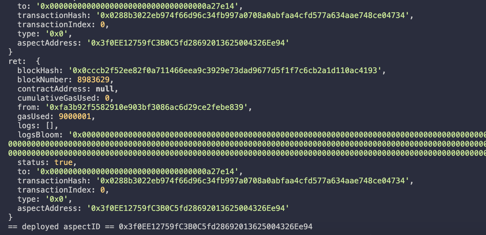

**Account address**: 0xFA3B92F5582910E903bF3086aC6D29cE2fEBe839

**Contract address**: 0x9f06146ef62224d5899c19E76bb759E42C46EDdB

**Aspect address**: 0x3f0EE12759fC3B0C5fd28692013625004326Ee94

## Create Contract


## Create Aspect ID



## Bind Contract


## Transaction Result


# Throttler Aspect (Simplified Version)


Simplified version of Throttler Aspect from [ShiningRay](https://github.com/ShiningRay/), this Aspect is used for limiting the request rate of certain smart contract.

**Typical Scenario**:

- In airdrop, limit the per address claim frequency.
- For influential projects, protect from DDoS.

## Problem Addressed

In many scenarios, we want to prevent certain interfaces or methods from being called too frequently, which brings about the concept of rate limiting. For instance, in a web front-end where typing triggers a search function, we can set a time interval to prevent users from triggering the search too frequently. During this interval, the user can only trigger the search once.

Similarly, in blockchain, there are comparable scenarios. For example, during an airdrop, we don't want users to claim the airdrop too frequently. Therefore, we can set a time interval during which users can only claim the airdrop once.

## Project Design

### Implementation

By using the `mutableState` of Aspect to store information about method calls, we can check the frequency of method calls in the `PreContractCall` aspect. If the frequency exceeds the limit, the transaction is reverted.

### Comparison with Pure EVM Implementation

In the EVM ecosystem, rate limiting can be implemented within the contract. However, if the contract does not already include rate limiting logic, upgrading the contract can be relatively cumbersome. With Aspect, rate limiting functionality can be added to the contract without modifying the contract itself.

## How to Run

Create an address

```bash
$ npm run account:create
address:  0x6B70B03B608a19Bf1817848A4C8FFF844f0Be0fB
```

The script will then create a private key file named `privateKey.txt` in the project directory. You can also input your own private key if you prefer. Note down your address, and then you can request test tokens from the Artela Discord faucet.

### Compile and Deploy Contracts

```bash
$ npm run contract:build

$ npm run contract:deploy

> contract:deploy
> node scripts/contract-deploy.cjs --name Counter

from address:  0x6B70B03B608a19Bf1817848A4C8FFF844f0Be0fB
(node:87588) ExperimentalWarning: The Fetch API is an experimental feature. This feature could change at any time
(Use `node --trace-warnings ...` to show where the warning was created)
deploy contract tx hash: 0x55d445796c0bc4435e827e88ee35104205369c685d9f06bbfc42d37bd4229769
{
  blockHash: '0xb26ee4e2a2f24f1e10b13b9978ca16651f85ac862dd586770fa174dcdb325fd8',
  blockNumber: 2175119,
  contractAddress: '0x9CEAE67580eB1d82B9CeEe53e57f137f66D87d83',
  cumulativeGasUsed: 3500000,
  from: '0x6b70b03b608a19bf1817848a4c8fff844f0be0fb',
  gasUsed: 7000001,
  logs: [],
  logsBloom: '0x00000000000000000000000000000000000000000000000000000000000000000000000000000000000000000000000000000000000000000000000000000000000000000000000000000000000000000000000000000000000000000000000000000000000000000000000000000000000000000000000000000000000000000000000000000000000000000000000000000000000000000000000000000000000000000000000000000000000000000000000000000000000000000000000000000000000000000000000000000000000000000000000000000000000000000000000000000000000000000000000000000000000000000000000000000000',
  status: true,
  to: null,
  transactionHash: '0x55d445796c0bc4435e827e88ee35104205369c685d9f06bbfc42d37bd4229769',
  transactionIndex: 0,
  type: '0x0'
}
contract address:  0x9CEAE67580eB1d82B9CeEe53e57f137f66D87d83
--contractAccount 0x6B70B03B608a19Bf1817848A4C8FFF844f0Be0fB --contractAddress 0x9CEAE67580eB1d82B9CeEe53e57f137f66D87d83

```

Remember the address of the deployed contract, as it will be needed for binding later.

### Compile Aspect

```bash
$ npm run aspect:build
```

After building, run the deployment script.

```bash
$ node scripts/aspect-deploy.cjs --interval 5 --limit 2

from address:  0x6B70B03B608a19Bf1817848A4C8FFF844f0Be0fB
sending signed transaction...
{
  blockHash: '0xdaaa2b913be2bb3007a6324b1ac81f5c824a9d61e52775f0cf300b8d66b87967',
  blockNumber: 2177337,
  contractAddress: null,
  cumulativeGasUsed: 0,
  from: '0x6b70b03b608a19bf1817848a4c8fff844f0be0fb',
  gasUsed: 9000001,
  logs: [],
  logsBloom: '0x00000000000000000000000000000000000000000000000000000000000000000000000000000000000000000000000000000000000000000000000000000000000000000000000000000000000000000000000000000000000000000000000000000000000000000000000000000000000000000000000000000000000000000000000000000000000000000000000000000000000000000000000000000000000000000000000000000000000000000000000000000000000000000000000000000000000000000000000000000000000000000000000000000000000000000000000000000000000000000000000000000000000000000000000000000000',
  status: true,
  to: '0x0000000000000000000000000000000000a27e14',
  transactionHash: '0xf665be06dbd652060dda053beb599c0b9da710314d32a79b35189082f776ec58',
  transactionIndex: 0,
  type: '0x0',
  aspectAddress: '0x9AE212EFbc8935D95DD266947cDb231571c1A09e'
}
ret:  {
  blockHash: '0xdaaa2b913be2bb3007a6324b1ac81f5c824a9d61e52775f0cf300b8d66b87967',
  blockNumber: 2177337,
  contractAddress: null,
  cumulativeGasUsed: 0,
  from: '0x6b70b03b608a19bf1817848a4c8fff844f0be0fb',
  gasUsed: 9000001,
  logs: [],
  logsBloom: '0x00000000000000000000000000000000000000000000000000000000000000000000000000000000000000000000000000000000000000000000000000000000000000000000000000000000000000000000000000000000000000000000000000000000000000000000000000000000000000000000000000000000000000000000000000000000000000000000000000000000000000000000000000000000000000000000000000000000000000000000000000000000000000000000000000000000000000000000000000000000000000000000000000000000000000000000000000000000000000000000000000000000000000000000000000000000',
  status: true,
  to: '0x0000000000000000000000000000000000a27e14',
  transactionHash: '0xf665be06dbd652060dda053beb599c0b9da710314d32a79b35189082f776ec58',
  transactionIndex: 0,
  type: '0x0',
  aspectAddress: '0x9AE212EFbc8935D95DD266947cDb231571c1A09e'
}
== deploy aspectID == 0x9AE212EFbc8935D95DD266947cDb231571c1A09e
```

The parameters are as follows:

- interval: The number of seconds for the rate limiting
- limit: The maximum number of times the method can be executed within the interval

Remember the final aspectID for future binding.

### Binding

Run the `bind.cjs` script and input the previously deployed contract address (or your own contract address) and the aspect id.

```bash
$ node scripts/bind.cjs --contract <CONTRAT_ADDRESS> --aspectId <ASPECT_ID>

sending signed transaction...
{
  blockHash: '0x619117094ee0083aafdb5400891c5e293976306d112e05a58d8836b24c808e68',
  blockNumber: 2175732,
  contractAddress: null,
  cumulativeGasUsed: 0,
  from: '0x6b70b03b608a19bf1817848a4c8fff844f0be0fb',
  gasUsed: 9000001,
  logs: [],
  logsBloom: '0x00000000000000000000000000000000000000000000000000000000000000000000000000000000000000000000000000000000000000000000000000000000000000000000000000000000000000000000000000000000000000000000000000000000000000000000000000000000000000000000000000000000000000000000000000000000000000000000000000000000000000000000000000000000000000000000000000000000000000000000000000000000000000000000000000000000000000000000000000000000000000000000000000000000000000000000000000000000000000000000000000000000000000000000000000000000',
  status: true,
  to: '0x0000000000000000000000000000000000a27e14',
  transactionHash: '0x59529c6cbb2658e9f8f70ae3848fd52990c2e3d96e0cf58c26b4a83e14e76f13',
  transactionIndex: 0,
  type: '0x0'
}
== aspect bind success ==
```

Then, we can execute the script to query the Aspect bound to the contract and check if the binding was successful.

```bash
$ node scripts/query.cjs --contract <CONTRAT_ADDRESS>
bound aspects : 0x9AE212EFbc8935D95DD266947cDb231571c1A09e,1,1
```

If the output displays the aforementioned `aspectID`, it indicates that the binding was successful.

### Testing

`scripts/batch-test.cjs` will batch send contract transactions to test the rate limiting functionality.

```bash
$ node scripts/batch-test.cjs

#0
call contract tx hash: 0x8fbf4f2768e265045ee18a8d9c846a187656ff69b12c65776ac05958fe6ce6c9
#1
call contract tx hash: 0x7db621cbf06bed8d1569517292427ba06c65ab361ff8fc110ad2be3e6396b0c8
#2
call contract tx hash: 0x9d1c26f29a63f0b074a9743c0383a2e5d12eb3cd048627aa6cde98d9da6ad6be
#3
call contract tx hash: 0xbbc0452038fe672ad77b8acb16dc8ad7a4e12c00389aa24458762e30810b988c
#4
call contract tx hash: 0x2f678aebc6a635d490f1e306eab34a2fab9bdc3406598ed963378ccc97b40a28
#5
{
  blockHash: '0xe73887b147b24d68077b54ef4dc6d20a3682b895780c129f1c73c993c3f9f06c',
  blockNumber: 2177577,
  contractAddress: null,
  cumulativeGasUsed: 2000000,
  from: '0x6b70b03b608a19bf1817848a4c8fff844f0be0fb',
  gasUsed: 4000001,
  logs: [],
  logsBloom: '0x00000000000000000000000000000000000000000000000000000000000000000000000000000000000000000000000000000000000000000000000000000000000000000000000000000000000000000000000000000000000000000000000000000000000000000000000000000000000000000000000000000000000000000000000000000000000000000000000000000000000000000000000000000000000000000000000000000000000000000000000000000000000000000000000000000000000000000000000000000000000000000000000000000000000000000000000000000000000000000000000000000000000000000000000000000000',
  status: true,
  to: '0x9ceae67580eb1d82b9ceee53e57f137f66d87d83',
  transactionHash: '0x8fbf4f2768e265045ee18a8d9c846a187656ff69b12c65776ac05958fe6ce6c9',
  transactionIndex: 0,
  type: '0x0'
}
call contract tx hash: 0x7db43657de0bd98ede59ece6ec54c5db1397998320cc9d4375848a04a9e19419
#6
/Users/shiningray/projects/personal/throttle-aspect/node_modules/web3-core-helpers/lib/errors.js:90
        var error = new Error(message);
                    ^

Error: Transaction has been reverted by the EVM:
{
  "blockHash": "0x81ce98a29a43349e5e23dee5e57ed6af94287f91c42eb018bdb6d92a357b7cd4",
  "blockNumber": 2177579,
  "contractAddress": null,
  "cumulativeGasUsed": 4000000,
  "from": "0x6b70b03b608a19bf1817848a4c8fff844f0be0fb",
  "gasUsed": 4000001,
  "logs": [],
  "logsBloom": "0x00000000000000000000000000000000000000000000000000000000000000000000000000000000000000000000000000000000000000000000000000000000000000000000000000000000000000000000000000000000000000000000000000000000000000000000000000000000000000000000000000000000000000000000000000000000000000000000000000000000000000000000000000000000000000000000000000000000000000000000000000000000000000000000000000000000000000000000000000000000000000000000000000000000000000000000000000000000000000000000000000000000000000000000000000000000",
  "status": false,
  "to": "0x9ceae67580eb1d82b9ceee53e57f137f66d87d83",
  "transactionHash": "0x9d1c26f29a63f0b074a9743c0383a2e5d12eb3cd048627aa6cde98d9da6ad6be",
  "transactionIndex": 1,
  "type": "0x0"
}
    at Object.TransactionError (/Users/shiningray/projects/personal/throttle-aspect/node_modules/web3-core-helpers/lib/errors.js:90:21)
    at Object.TransactionRevertedWithoutReasonError (/Users/shiningray/projects/personal/throttle-aspect/node_modules/web3-core-helpers/lib/errors.js:101:21)
    at /Users/shiningray/projects/personal/throttle-aspect/node_modules/@artela/web3-core-method/lib/index.js:456:57
    at process.processTicksAndRejections (node:internal/process/task_queues:95:5) {
  receipt: {
    blockHash: '0x81ce98a29a43349e5e23dee5e57ed6af94287f91c42eb018bdb6d92a357b7cd4',
    blockNumber: 2177579,
    contractAddress: null,
    cumulativeGasUsed: 4000000,
    from: '0x6b70b03b608a19bf1817848a4c8fff844f0be0fb',
    gasUsed: 4000001,
    logs: [],
    logsBloom: '0x00000000000000000000000000000000000000000000000000000000000000000000000000000000000000000000000000000000000000000000000000000000000000000000000000000000000000000000000000000000000000000000000000000000000000000000000000000000000000000000000000000000000000000000000000000000000000000000000000000000000000000000000000000000000000000000000000000000000000000000000000000000000000000000000000000000000000000000000000000000000000000000000000000000000000000000000000000000000000000000000000000000000000000000000000000000',
    status: false,
    to: '0x9ceae67580eb1d82b9ceee53e57f137f66d87d83',
    transactionHash: '0x9d1c26f29a63f0b074a9743c0383a2e5d12eb3cd048627aa6cde98d9da6ad6be',
    transactionIndex: 1,
    type: '0x0'
  }
}
```

If the script returns an error, it indicates that the rate limiter has successfully prevented the transaction from going through.
